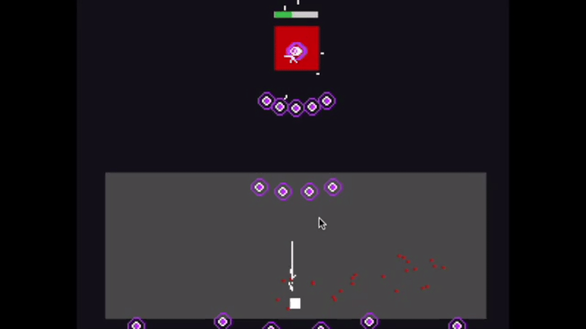
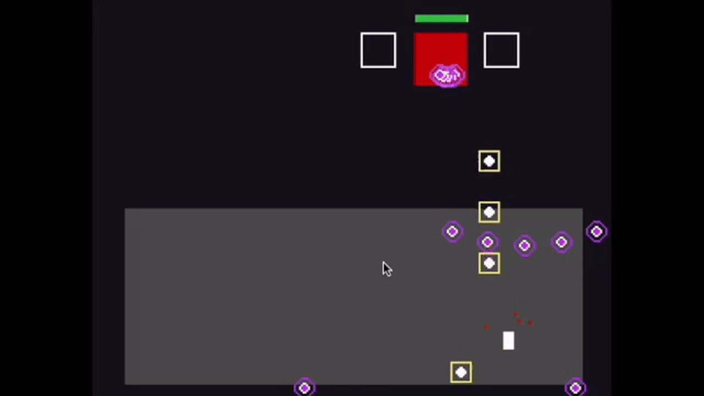

# YOU vs <span style=color:red;>RED</span>

_A top-down shooter boss fight built in Pygame._

## About the Game

You control a lone player dodging waves of bullets fired by Red and his
helpers. YOU vs RED draws inspiration from bullet-hell acrade games
without fully adpoting the genre\'s design rules.

### References used:

- The Electric Underground (background into the genre)
- Andrew Fan (bullet design & mechanics)

## Survive

<p align="center">
  
</p>

Survive waves of bullets. The game uses bullets pooling for perforamance
and consistency projectile behavior. Red and his helpers run on a
modular system with independent movement, bullet pattern and combat
components, enabling customization.

## Shoot

<p align="center">
  
</p>

Defeat Red and his helpers by shooting them. The game uses clear visual
feedback to strengthen game feel. Squash-and-stretch animations
emphasize shooting, procedural blood particles respond to hits, and
collision sparks mark impacts instantly.

## Controls

- Move: Arrow keys
- Attack: Spacebar
- Quit: Window

## Current State

The project is no longer just a playable game. It has been rebuilt into a modular engine system.

The gameplay can still be put together using the existing systems, but the main play loop has been redesigned to improve the overall structure and organization.

## Running the Game

```bash
python -m venv venv
source venv/bin/activate
pip install -r requirements.txt
python main.py
```

## Project Status

You vs Red is a **work in progress**.

## Changelog

### v1.1

- added Level building engine.
- removed immediate boss fight and fighting platform.
- changed the player's bullet collision from rect to rect collision to line to rect collision.
- added particle effect to enemies.

### v1.0

- intial fork.
